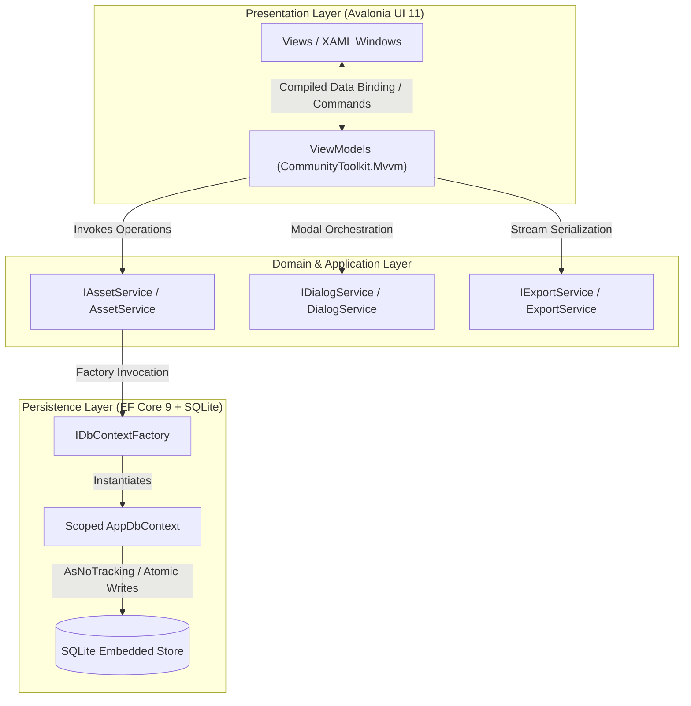
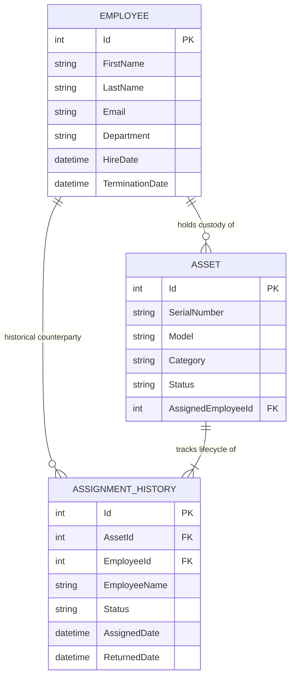
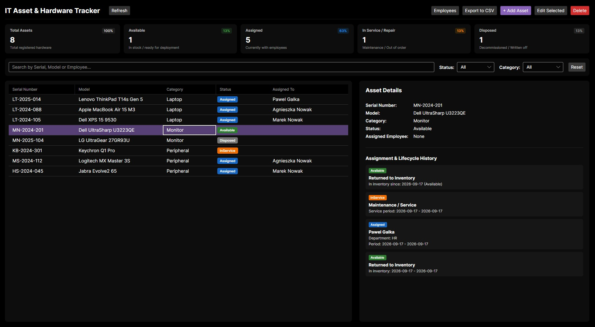
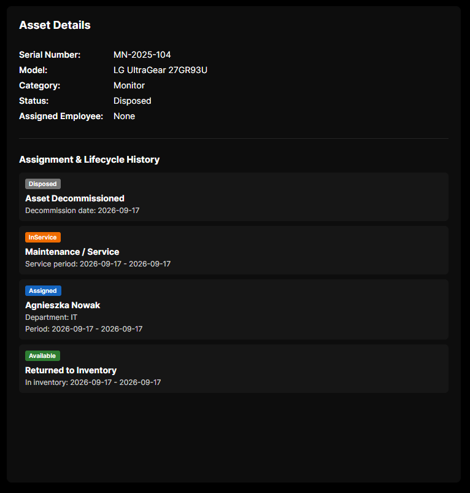
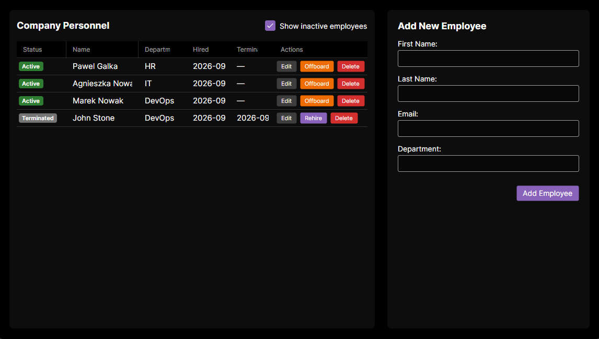
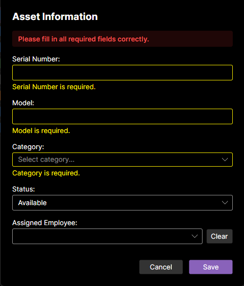

# IT Asset & Hardware Tracker

[](https://dotnet.microsoft.com/)
[](https://avaloniaui.net/)
[](https://learn.microsoft.com/ef/core/)
[](https://learn.microsoft.com/dotnet/communitytoolkit/mvvm/)
[](LICENSE)

An enterprise-grade cross-platform desktop application engineered for Internal IT Operations to manage physical hardware lifecycles, enforce auditable custody delegation, and automate personnel offboarding workflows. Built with **C# 13**, **.NET 9**, **Avalonia UI**, and **Entity Framework Core** using **SQLite**.

---

## 1. Business Problem & Solution

### The Business Problem
Small to medium enterprises and IT departments frequently manage company assets through ad-hoc spreadsheets and disconnected ticketing systems. This operational anti-pattern introduces severe compliance and financial risks:
* **Ghost Hardware & Asset Leakage:** Equipment assigned to departing employees remains unrecovered due to desynchronized HR and IT termination workflows.
* **Corrupted Chain of Custody:** Lack of immutable historical records makes hardware audit trails untrustworthy during asset recovery, warranty servicing, or ISO/IEC 27001 and SOC 2 audits.
* **State Machine Inconsistencies:** Spreadsheets permit impossible domain transitions, such as assigning a device currently marked as decommissioned or undergoing physical repair.
* **Concurrency & Integrity Violations:** Manual multi-user entries produce duplicate serial numbers, conflicting allocations, and orphaned database records.

### The Engineering Solution
**IT Asset & Hardware Tracker** replaces spreadsheet fragility with a deterministic desktop client backed by a relational database:
* **Strict State Enforcement:** Hardware follows an explicit state machine (`Available`, `Assigned`, `InService`, `Disposed`), rejecting conflicting assignments at the domain layer.
* **Atomic Offboarding Workflow:** A single transaction terminates the employee record, unassigns active hardware, updates inventory return records, and returns devices to stock.
* **Immutable Snapshot Audit Trail:** Historical assignments capture point-in-time employee snapshots to guarantee audit permanence even if employee records are subsequently purged.
* **Live In-Memory Telemetry:** Synchronous calculation of inventory ratios and utilization rates provides immediate KPI distribution without UI thread starvation or redundant database roundtrips.

---

## 2. Architecture & Design Patterns

The system adheres to Clean MVVM principles, prioritizing separation of concerns, testability, and UI thread safety.



### Key Architectural Decisions

#### MVVM via Roslyn Source Generators
The presentation layer leverages `CommunityToolkit.Mvvm`:
* Attributes (`[ObservableProperty]`, `[RelayCommand]`) eliminate repetitive boilerplate, reducing runtime memory allocations and ensuring full Native AOT readiness.
* ViewModels inherit from `ObservableValidator` to implement `INotifyDataErrorInfo`, executing submit-driven validation to prevent premature error banners while typing.

#### Desktop Database Lifetime (`IDbContextFactory`)
Long-lived `DbContext` instances in desktop applications introduce runaway memory caches, stale queries, and cross-thread concurrency collisions.
* Operations are scoped via `IDbContextFactory<AppDbContext>`. Each service method instantiates a short-lived context (`await using var context = await contextFactory.CreateDbContextAsync()`) dedicated to a single unit of work.
* Analytical, list, and filter queries enforce `.AsNoTracking()` to eliminate Change Tracker overhead and minimize GC pressure.

#### Modal Ownership & Window Cascade
A centralized `IDialogService` dynamically tracks the active application window (`desktop.Windows.LastOrDefault(w => w.IsActive)`). This prevents desktop z-order deadlocks and window focus freezing when nested modal dialogs are invoked.

---

## 3. Data Model & Schema

The relational schema is configured via EF Core Fluent API with composite indexing, filtered indexes, and explicit value conversions.



### Relational Schema Optimizations
* **Composite Chronological Index:** `IX_AssignmentHistories_AssetId_AssignedDate` ensures timeline queries for any specific hardware device execute in logarithmic time O(log n).
* **Filtered Index:** `IX_Employees_TerminationDate` with predicate `WHERE [TerminationDate] IS NULL` accelerates lookups for active, assignable personnel across large employee rosters.
* **Global UTC Value Conversion:** A global `UtcDateTimeConverter` ensures consistent ISO 8601 storage without timezone drift across persistence roundtrips.

---

## 4. Key Engineering Challenges & Trade-offs

### 1. Atomic Employee Offboarding Workflow
* **Challenge:** Offboarding an employee requires terminating their record, revoking custody of multiple active devices, setting those devices back to `Available`, and closing open history records with timestamps. A failure midway through leaves devices locked in an unassigned, unreachable limbo.
* **Solution:** Orchestrated within `AssetService.OffboardEmployeeAsync` using a single execution context. The routine updates `Employee.TerminationDate`, retrieves all assigned hardware, closes active `AssignmentHistory` entries (`ReturnedDate = DateTime.UtcNow`), writes new inventory check-in audit records, clears foreign keys, and commits changes atomically via `SaveChangesAsync()`.
* **Hard Deletion Guard:** To prevent broken tracking chains, hard deletion of an employee is blocked by a domain check if any assets are actively assigned.

### 2. High-Frequency In-Memory Filtering & Virtualization
* **Challenge:** Dynamic multi-criteria filtering (Model, Serial, Assignee, Category, Status) can trigger frame drops and UI freezes if executed as repeated SQL queries on every keystroke.
* **Solution:** Master data is loaded once into a private cache (`_allAssets`) upon navigation or mutation. Searches execute against this collection using case-insensitive ordinal comparisons (`StringComparison.OrdinalIgnoreCase`). Value converters (`StatusToBrushConverter`) are implemented as thread-safe immutable singletons accessed directly via `{x:Static}` compiled bindings to eliminate resource dictionary lookup overhead inside virtualized `DataGrid` cells.

### 3. Immutable Snapshot Audit Pattern
* **Challenge:** Normal foreign key relationships become brittle when personnel entities are edited or purged under data retention policies, risking physical equipment audit logs.
* **Solution:** `AssignmentHistory` implements `DeleteBehavior.SetNull` on `EmployeeId` while permanently capturing an immutable textual projection `EmployeeName` at the exact moment of custody transfer. If the employee record is later removed, the asset maintains an unbroken record of historical custodianship.

### 4. Excel-Safe CSV Export & Injection Safeguards
* **Challenge:** CSV files opened in spreadsheet applications frequently corrupt non-ASCII characters and remain vulnerable to CSV Formula Injection attacks.
* **Solution:** The export pipeline uses RFC 4180 streaming via Avalonia's `IStorageProvider` using `new UTF8Encoding(encoderShouldEmitUTF8Identifier: true)` (BOM), ensuring correct character rendering. Cell values starting with formula execution operators (`=`, `+`, `-`, `@`) are sanitized by prepending an apostrophe (`'`), neutralizing macro execution risks.

---

## 5. Visual Showcase

| View | Description | Screenshot |
| :--- | :--- | :--- |
| **Telemetry Dashboard & Inventory Grid** | Real-time metric cards displaying inventory distribution percentages, live search, and master-detail split layout. |  |
| **Audit & Lifecycle Timeline** | Detailed breakdown of past assignments, depot return events, and active servicing intervals per asset. |  |
| **Personnel Offboarding Lifecycle** | Two-step termination modal enforcing automatic hardware recovery back to inventory. |  |
| **Submit-Driven Form Validation** | Validation feedback implementing `INotifyDataErrorInfo` triggered on form submission. |  |

---

## 6. Project Structure

```plaintext
HardwareTracker/
├── Converters/              # Optimized immutable XAML value converters
│   ├── ActiveStatusToBrushConverter.cs
│   └── StatusToBrushConverter.cs
├── Data/                    # Persistence, migrations, and EF Core mapping
│   ├── AppDbContext.cs
│   └── Migrations/
├── Models/                  # Domain entities, value objects, and enums
│   ├── Asset.cs
│   ├── AssetStatus.cs
│   ├── AssignmentHistory.cs
│   └── Employee.cs
├── Services/                # Application & infrastructure service contracts
│   ├── AssetService.cs
│   ├── DialogService.cs
│   ├── ExportService.cs
│   ├── IAssetService.cs
│   ├── IDialogService.cs
│   └── IExportService.cs
├── ViewModels/              # Source-generated CommunityToolkit MVVM ViewModels
│   ├── AssetEditViewModel.cs
│   ├── ConfirmationViewModel.cs
│   ├── EmployeesViewModel.cs
│   ├── MainWindowViewModel.cs
│   └── ViewModelBase.cs
└── Views/                   # Avalonia UI XAML markup and view code-behinds
    ├── AssetEditWindow.axaml
    ├── ConfirmationWindow.axaml
    ├── EmployeesWindow.axaml
    └── MainWindow.axaml
```

---

## 7. Getting Started

### Prerequisites
* **.NET 9.0 SDK** (v9.0.100 or higher)
* Supported OS: Windows 10/11, macOS 12+, or modern Linux distributions (X11/Wayland)
* Optional: `dotnet-ef` CLI tool for inspecting migrations:
  ```bash
  dotnet tool install --global dotnet-ef
  ```

### Build & Execution

1. **Clone the repository:**
   ```bash
   git clone https://github.com/Pawel-Galka/it-asset-hardware-tracker.git
   cd it-asset-hardware-tracker
   ```

2. **Restore project dependencies:**
   ```bash
   dotnet restore
   ```

3. **Build the application:**
   ```bash
   dotnet build --configuration Release
   ```

4. **Launch the application:**
   ```bash
   dotnet run --project HardwareTracker
   ```

> *Note:* The local SQLite database (`hardware_tracker.db`) is automatically provisioned and seeded with initial demo hardware and personnel data on the first run via `AppDbContext.Database.Migrate()`.

---

## 8. License

Distributed under the MIT License. See `LICENSE` for details.
